# QuantumSandbox 🚀

### Self-Healing Multi-Agent Secure Execution Engine

https://github.com/user-attachments/assets/7a7afda7-a81b-40d1-aa54-dfa6b7e40ae5

QuantumSandbox is a production-grade, highly secure **agentic code generation and runtime engine** built from first principles in Bun. It solves the critical fragility and security bottlenecks of modern LLM code generators by virtualizing execution spaces and implementing a genetic self-correction loop.

Instead of writing static script generators that risk infinite loops, memory leaks, system escapes, or syntax crashes, QuantumSandbox runs a **Generative Adversarial Swarm** (Builder & Auditor) to write and aggressively test code in a V8 isolated sandbox, recursively repairing faults using deep stack trace analysis.

---

## 🏛️ System Architecture

QuantumSandbox is designed around strict data-execution separation and isolated V8 context virtualization:

```mermaid
sequenceDiagram
    participant User as User / Web Dashboard
    participant Engine as QuantumSandbox Engine (Bun)
    participant Swarm as Adversarial Swarm (Builder & Auditor)
    participant VM as Isolated V8 Sandbox (node:vm)
    participant Healer as Self-Healing Agent (LLM)

    User->>Engine: Prompt: "Write reverseString function"
    Engine->>Swarm: Dispatch Builder & Auditor
    Swarm-->>Engine: Returns core script + 5 aggressive assertions
    
    rect rgb(28, 28, 30)
        Note over Engine, VM: Attempt 1: Compilation Run
        Engine->>VM: Compile & Execute code (Capped: 1000ms)
        VM-->>Engine: Results: [FAILED] (TypeError: null is not an object at line 4)
    end

    rect rgb(44, 44, 46)
        Note over Engine, Healer: Genetic Self-Correction Loop
        Engine->>Healer: Send: Failing Code + Stack Trace + Test Logs
        Healer-->>Engine: Returns corrected code patch (if (str === null) return 'null';)
    end

    rect rgb(28, 28, 30)
        Note over Engine, VM: Attempt 2: Compilation Run
        Engine->>VM: Compile & Execute patched code
        VM-->>Engine: Results: [PASSED] (100% tests successful!)
    end

    Engine-->>User: Stream logs via Server-Sent Events (SSE) + Return safe code
```



---

## 🌟 Key Features & Systems Concepts

### 1. V8 Isolated Sandbox Context (`sandbox.ts`)
*   **Scope Isolation**: Runs code utilizing Node's built-in `node:vm` context. It strips away all global system-level variables (`process`, `require`, `fs`, `fetch`), containing execution to a completely virtualized V8 environment.
*   **CPU Infinite Loop Shield**: Enforces a strict hardware execution timeout (`timeout: 1000ms`). If the AI generates an accidental infinite loop (`while(true)`), V8 interrupts the execution thread immediately, keeping the host server safe and responsive.
*   **Stdout Redirection**: Intercepts the sandbox's `console.log` and `console.error` calls, redirecting outputs directly into memory arrays.

### 2. Adversarial Swarm Framework (`swarm.ts`)
*   **Builder Agent**: An elite programmer agent focused strictly on writing clean, high-performance vanilla JavaScript algorithms.
*   **Auditor Agent**: A cynical, hostile QA automation agent. It inspects the Builder's code and writes 5+ aggressive assertions targeting edge cases (e.g. empty strings, null values, numerical boundaries) to actively try and break the Builder's script.
*   **Strict JSON API Contracts**: Forces LLMs to output pure parsable JSON payloads natively (`response_format: { type: "json_object" }`), ensuring complete deterministic parsing without fragile markdown regex wrappers.

### 3. Recursive Genetic Healer (`engine.ts`)
*   **Stack Trace Analysis**: Captures V8 runtime errors, assertion messages, and call stacks on sandbox failure.
*   **Genetic Correction**: Passes the failing script, assertions, and stack trace to the Healer Agent. The Healer identifies the exact coordinates of the crash (e.g., a null pointer at line 4) and compiles a precise code patch.
*   **Recursive Healing Loop**: Repeats execution and patching recursively (up to 4 attempts) until the script passes 100% of the assertions.

### 4. Real-Time Streaming SSE Web Terminal (`server.ts`)
*   **Non-Buffered Web Streams**: Implements a high-performance HTTP server in Bun, serving a glowing, responsive obsidian glassmorphism web dashboard.
*   **Server-Sent Events (SSE)**: Streams internal compiler logs, agent debates, and sandbox failures to the web browser in real-time. The user watches the AI fail, debug itself, and succeed live in a scroll-locked terminal.

---

## 📂 Project Directory Structure

```
quantumsandbox/
├── sandbox.ts        # Secure V8 sandbox context execution & timeout limits
├── swarm.ts          # Adversarial Agents (Builder & Auditor) with JSON contracts
├── engine.ts         # Main self-healing orchestrator and Healer Agent
├── server.ts         # High-speed Bun.serve backend serving HTML dashboard & SSE streams
├── test_sandbox.ts   # Security harness verifying V8 timeout & escape isolation
├── test_swarm.ts     # Script testing adversarial swarm assembly
└── test_engine.ts    # Script testing end-to-end self-healing capabilities
```

---

## 🚀 Getting Started

### 📋 Prerequisites
Ensure you have the blazing fast **Bun** runtime installed on your machine. If you don't, install it via:
```bash
curl -fsSL https://bun.sh/install | bash
```

### 1. Installation
Clone the repository and install the development dependencies:
```bash
cd quantumsandbox
bun install
```

### 2. Environment Setup
Export your OpenAI API Key into your terminal session:
```bash
export OPENAI_API_KEY="your-real-api-key-here"
```

### 3. Run the Verification Test Suites
Verify sandbox security, swarm generation, and self-healing loops locally:
```bash
# Test 1: Assertions, timeouts, and sandbox escape isolation
bun run test_sandbox.ts

# Test 2: Adversarial code-testing assembly
bun run test_swarm.ts

# Test 3: End-to-end self-correcting genetic loop
bun run test_engine.ts
```

### 4. Launch the Web Dashboard
Boot the high-performance Bun web server:
```bash
bun run server.ts
```
Once booted, open your browser and navigate to:
👉 **`http://localhost:3000/`**

Type a requirement (e.g., *"Write a function named 'validateEmail' that checks if a string is a valid email. Include three test cases."*), click **"Compile & Heal"**, and watch the live self-correcting terminal in action!

---
